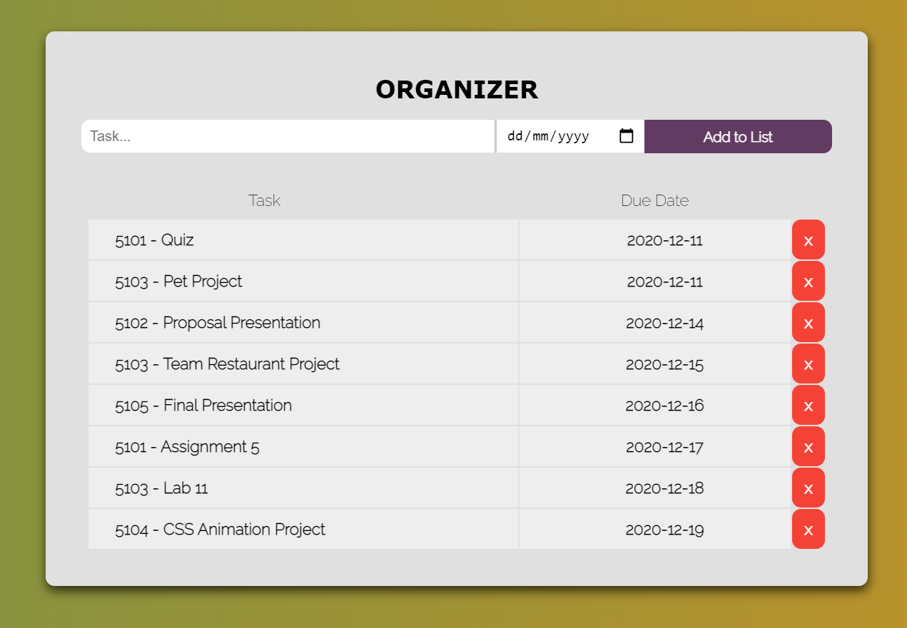

# HTTP5103 Pet Project - To Do List
### Individual Assignment
#### Description:

- This page allows users to create a listing of all tasks an assignments that are do.
- If the date has passed then the task will be atomatically deleted.
- All data shown now is dummy data.

Inputs upon saving data into database
- An edit button will appear, that allows the user to edit their task name or date.

  

## Images:

